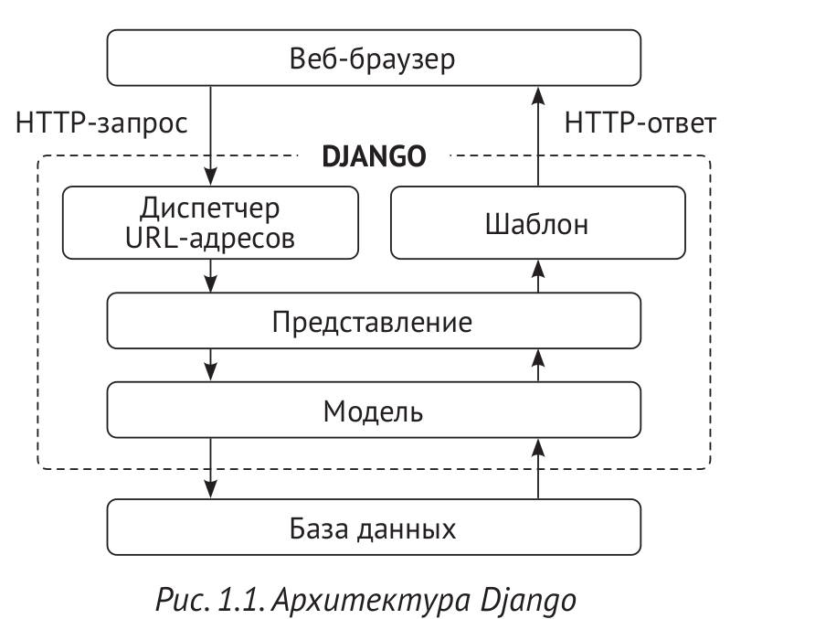

## Общий обзор веб-фреймворка Django

Компоненты Django слабо сцеплены между собой, и поэтому ими можно управлять независимо,
что помогает разделять обязанности разных слоев веб-фреймворка; слой базы данных ничего
не знает о том, как данные отображаются на странице, система шаблонов ничего не знает о веб-запроса и т.д.

Django обеспечивает максимальную возможность переиспользования исходного кода, следуя принципу DRY.

## Главные компоненты веб-фреймворка.
Django подчиняется шаблону архитектурного дизайна **MTV (Model-Template-View)**.

Обязанности в шаблоне архитектурного дизайна MTV Django распределены следующим образом:

- **Модель** - определяет логическую структуру данных и является обработчиком данных между данных и их представлением;
- **Шаблон** - это слой представления. В Django используется система текстовых шаблонов, в которой хранится всё, что браузер прорисовывает на страницах;
- **Представление** - взаимодействует с базой данных через модель и передает данные в шаблон для их прорисовки и просмотра.

Сам веб-фреймворк выступает в качестве контроллера. Он отправляет запрос в надлежащее представление в соответствии с конфигурацией URL-адреса.

В рамках Django "Шаблон" (или трафарет) представляет собой некую заготовку страницы
или пустой бланк, в котором выделено несколько пустых полей различной формы, служащий для размещения документов.

## Архитектура Django

Вот как Django оперирует HTTP-запросами и генерирует ответы:
1. Веб-браузер запрашивает страницу по её URL-адресу, и веб-сервер передает HTTP-запрос веб-фреймворку Django
2. Django просматривает свои сконфигурированные шаблоны URL-адресов и останавливается на первом,
который совпадает с запрошенным URL-адресом.
3. Django исполняет представление,соответствующее совпавшему шаблону URL-адреса.
4. Представление потенциально использует модели данных, чтобы  извлекать информацию из базы даннных.
5. Модели данных обеспечивают определение данных и их поведение. Они используют для запроса к базе данных.
6. Представление прорисовывает шаблон (обычно с использованием HTML), чтобы отобразить данные на странице,
возвращает их вместе с HTTP-ответом.

Под рендерингом (прорисовкой) понимается взятие промежуточного представления шаблона вместе с контекстом и его
превращение в итоговый поток байтов, который может быть передан клиенту (например браузеру). На тех. языке это
интерполяция (т.е заполнение) шаблона конктекстными данными и возврат регулирующего строкового литерала,
или трансляция данных в другой формат.

